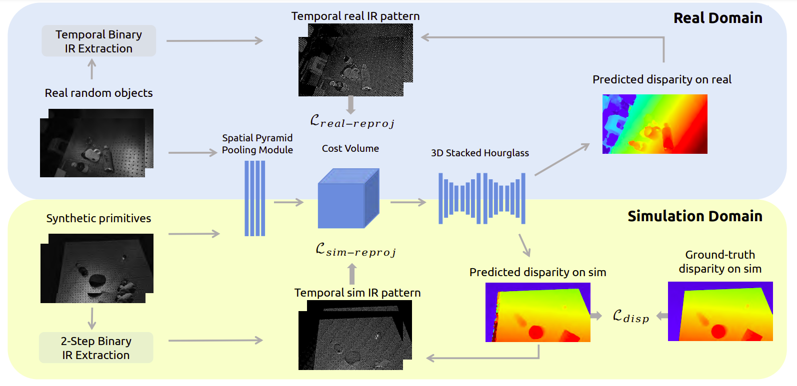

# ActiveZero: Mixed Domain Learning for Active Stereovision with Zero Annotation
### [[Paper]](https://arxiv.org/abs/2112.02772)
This repository contains the official implementation (in Pytorch) for "ActiveZero: Mixed Domain Learning for Active Stereovision with Zero Annotation" paper (CVPR 2022) by Isabella Liu, Edward Yang, Jianyu Tao, Rui Chen, Xiaoshuai Zhang, Qing Ran, Zhu Liu, and Hao Su.

### Citation
```
@misc{https://doi.org/10.48550/arxiv.2112.02772,
  doi = {10.48550/ARXIV.2112.02772},
  url = {https://arxiv.org/abs/2112.02772},
  author = {Liu, Isabella and Yang, Edward and Tao, Jianyu and Chen, Rui and Zhang, Xiaoshuai and Ran, Qing and Liu, Zhu and Su, Hao},
  keywords = {Computer Vision and Pattern Recognition (cs.CV), FOS: Computer and information sciences, FOS: Computer and information sciences},
  title = {ActiveZero: Mixed Domain Learning for Active Stereovision with Zero Annotation},
  publisher = {arXiv},
  year = {2021},
  copyright = {arXiv.org perpetual, non-exclusive license}
}

```

```
@misc{https://doi.org/10.48550/arxiv.2201.11924,
  doi = {10.48550/ARXIV.2201.11924},
  url = {https://arxiv.org/abs/2201.11924},
  author = {Zhang, Xiaoshuai and Chen, Rui and Xiang, Fanbo and Qin, Yuzhe and Gu, Jiayuan and Ling, Zhan and Liu, Minghua and Zeng, Peiyu and Han, Songfang and Huang, Zhiao and Mu, Tongzhou and Xu, Jing and Su, Hao},
  title = {Close the Visual Domain Gap by Physics-Grounded Active Stereovision Depth Sensor Simulation},
  publisher = {arXiv},
  year = {2022},
}
```

## Contents
1. [Introduction](#introduction)
2. [Installation](#installation)
3. [Training](#training)
4. [Testing](#testing)

## Introduction
we present a new framework, ActiveZero, which is a mixed domain learning solution for active stereovision systems that requires no real world depth annotation. First, we demonstrate the transferability of our method to out-of distribution real data by using a mixed domain learning strategy. In the simulation domain, we use a combination
of supervised disparity loss and self-supervised losses on a shape primitives dataset. By contrast, in the real domain, we only use self-supervised losses on a dataset that is out of-distribution from either training simulation data or test real data. Second, our method introduces a novel self supervised loss called temporal IR reprojection to increase the robustness and accuracy of our reprojections in hard to-perceive regions.




## Installation
### Dependencies
The code has been tested on the following system:

- Ubuntu 18.04
- Nvidia GPU (2 1080Ti or 2080Ti) and CUDA 11.4
- python 3.7
- pytorch 1.10.0

### Docker (Recommended)
We provide a [Dockerfile](https://hub.docker.com/r/isabella98/pix2pix) for building a container to run our code.
### Local Installation
```
pip install -r requirements.txt
```

## Training
We provide a default training script in `${REPO_ROOT_DIR}/configs/default.yaml` that uses the preset configurations to run our method. All preset configuration information is stored in `${REPO_ROOT_DIR}/configs/config.py`. To train with a different set of configurations, create a new `.yaml` in the `configs` directory that overwrites the configurations you want to change. An example is included in `${REPO_ROOT_DIR}/configs/train_psmnet.yaml` which trains the PSMnet model baseline.

To train, run:
```
export NGPUS=2
python -m torch.distributed.launch --nproc_per_node=$NGPUS train.py --config-file ./configs/${CONFIG}.yaml
```

## Testing
We provide a sample testing script in `${REPO_ROOT_DIR}/configs/test_psmnet.yaml` which tests a model called `model_best.pth` located in `/edward-slow-vol/checkpoints/psmnet_new_2/models/` on our testing simulation dataset. To test on our testing real dataset, set `LOSSES.ONREAL` in the testing scripting to `True`.
